# 🏗️ mdWebview — Architecture Reference

> **目的**：讓 AI 模型與開發者在 **不需要通讀 13,000 行程式碼** 的情況下，快速理解整個系統的架構、資料流與關鍵設計決策。
>
> 版本：v3.6.9 | 最後更新：2026-10

---

## 目錄

1. [系統架構總覽](#1-系統架構總覽)
2. [請求路由決策樹](#2-請求路由決策樹)
   - [2.1 Sitemap 防抖與 Stale-While-Revalidate 機制](#21-sitemap-防抖與-stale-while-revalidate-機制)
3. [資料流：頁面載入](#3-資料流頁面載入)
4. [資料流：大型檔案虛擬化](#4-資料流大型檔案虛擬化)
5. [資料流：全文搜尋](#5-資料流全文搜尋)
6. [公告彈窗顯示邏輯](#6-公告彈窗顯示邏輯)
7. [使用者偏好與排版控制](#7-使用者偏好與排版控制)
   - [7.1 集中式常數池與安全儲存封裝](#71-集中式常數池與安全儲存封裝)
   - [7.2 偏好備份與還原機制](#72-偏好備份與還原機制)
8. [後端模組架構與 API 路由索引](#8-後端模組架構與-api-路由索引)
   - [8.1 lib/ 原生模組職責劃分](#81-lib-原生模組職責劃分)
   - [8.2 server.js API 路由索引表](#82-serverjs-api-路由索引表)
9. [app.js 前端架構與 State 物件說明](#9-appjs-前端架構與-state-物件說明)
   - [9.1 段落索引與通用 Helper](#91-段落索引與通用-helper)
   - [9.2 State 物件欄位一覽](#92-state-物件欄位一覽)
10. [config.json 設定欄位一覽](#10-configjson-設定欄位一覽)
11. [關鍵常數速查](#11-關鍵常數速查)
12. [Worker Thread 架構](#12-worker-thread-架構)
13. [安全性設計](#13-安全性設計)
14. [CI/CD 與自動化維護工作流程](#14-cicd-與自動化維護工作流程)
15. [前端高並發與競態防護設計](#15-前端高並發與競態防護設計)
16. [CSS 樣式系統與響應式斷點設計](#16-css-樣式系統與響應式斷點設計)

---

## 1. 系統架構總覽

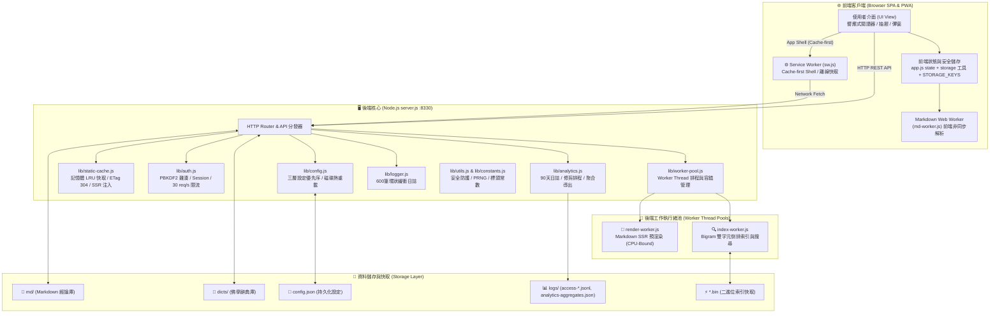

**核心設計原則：**
- **原生 CommonJS 模組化**：`server.js` 為乾淨路由入口，職責解耦至 `lib/` 模組（無 Express/第三方依賴）
- **雙 Worker Thread Pool**：CPU 密集型工作（Markdown 渲染、Bigram 倒排索引）透過獨立 Worker Thread 池並行處理，主事件迴圈零阻塞
- **全非同步 I/O**：所有磁碟存取與 Worker 呼叫均採用 Promise-based async/await
- **零外部 CDN**：所有前端依賴（marked.js、KaTeX、mermaid、字型）均本地託管於專案內
- **集中防禦性儲存**：前端全面透過 `STORAGE_KEYS` 常數池與 `storage` 安全防拋錯物件管理 `localStorage`

---

## 2. 請求路由決策樹

`server.js` 的主路由分發器依序判斷每個請求：

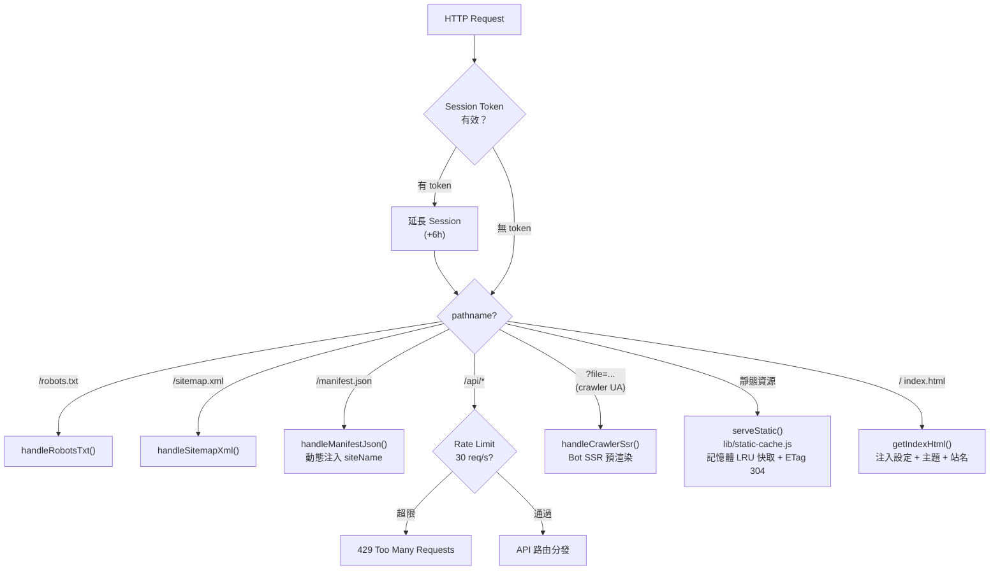

**Bot 偵測**：符合 `CRAWLER_UA_REGEX` 的 User-Agent 或帶有 `?ssr=1` 參數的請求，自動觸發 SSR 預渲染，回傳完整 HTML（含 schema.org JSON-LD）供搜尋引擎索引。

### 2.1 Sitemap 防抖與 Stale-While-Revalidate 機制

為防止大量 Markdown 檔案寫入或同步時（如批次上傳數千篇經論）造成伺服器頻繁重新掃描磁碟建立 Sitemap，引發 CPU 與磁碟 I/O 尖峰，系統採用**沉降防抖 + Stale-While-Revalidate** 快取架構：

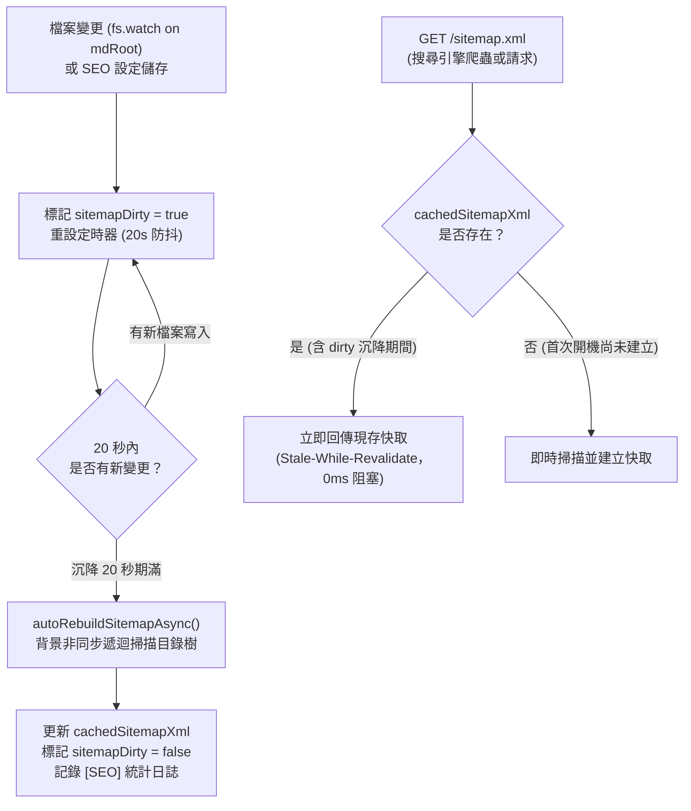

- **20 秒沉降防抖（Debounce）**：任何檔案變動皆重設計時器，直到連續 20 秒無新寫入才執行一次性重建，避免短時間內幾百次寫入觸發幾百次目錄樹遞迴掃描。
- **Stale-While-Revalidate**：即便標記為 dirty，外部請求依然立即可取得現有快取（200 OK 或 304 Not Modified），完全不卡頓伺服器執行緒與網路連線。
- **開機背景預熱**：伺服器啟動時，立即與 Bigram 搜尋索引同步非同步預先暖機建置 Sitemap 快取。
- **結構化日誌**：記錄每次生成耗時、檔案總數與 XML 位元組大小（`[SEO] Sitemap rebuilt: N URLs (X KB) in Yms`）。

---

## 3. 資料流：頁面載入

### 一般使用者（SPA）

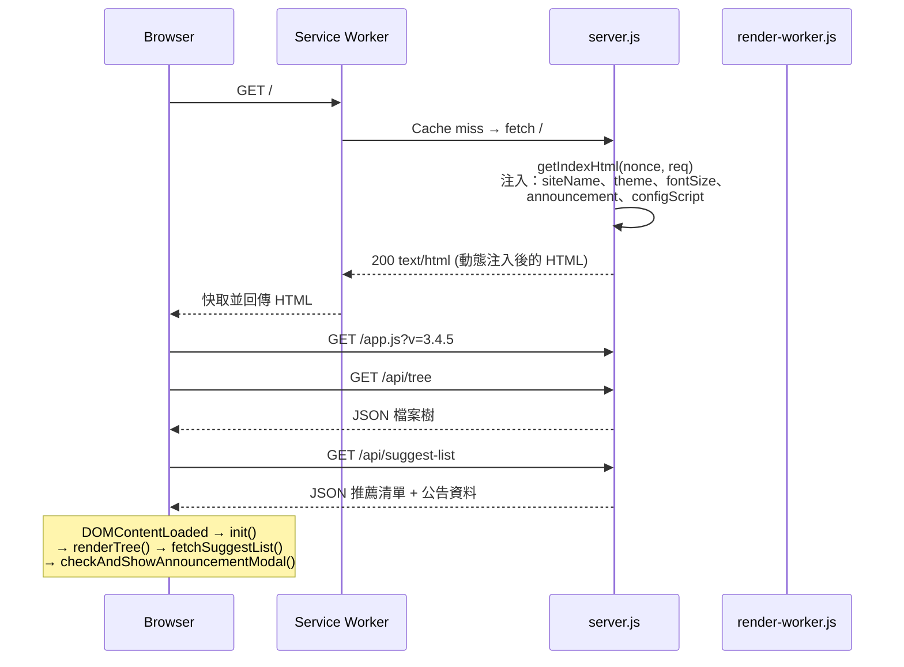

### 搜尋引擎爬蟲（SSR）

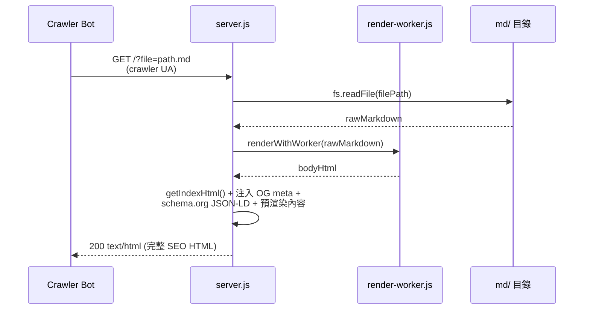

---

## 4. 資料流：大型檔案虛擬化

檔案大小 ≥ **1MB** (`LARGE_FILE_MIN_BYTES`) 時，啟動虛擬化渲染模式：

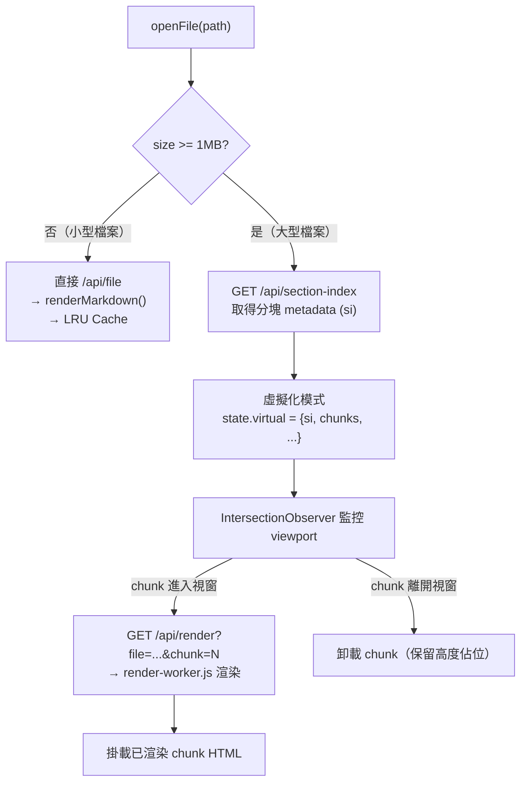

**section-index 格式**（由 `index-worker.js` 建立）：
- 每個 "entry"（如辭典詞條）的起止行號與位元組偏移
- 用於辭典條目導航（`entryNav` prev/next）與精確分塊邊界

---

## 5. 資料流：全文搜尋

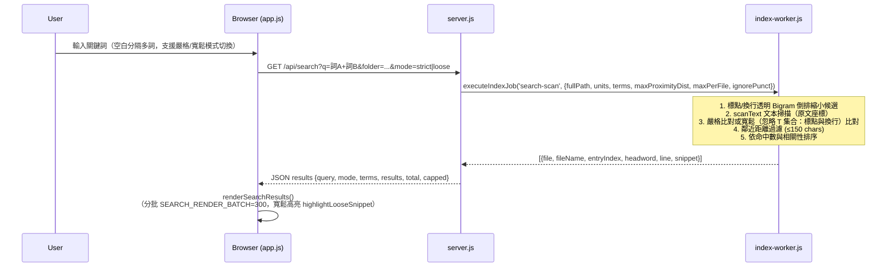

**Bigram 索引架構：**
- **建立時機**：首次搜尋時 lazy build，之後快取（記憶體 + `.bin` 二進位磁碟快取）
- **標點/換行透明性**：CJK 字元間遇到標點符號或行終止符（`\p{P}`、LF `\n`、CR `\r`、NEL `\u0085`、`\u2028`、`\u2029`）等透明字元 T 時不中斷 Bigram 產生（如「菩薩，行深」或跨行「菩薩\n行深」均產生「薩行」）；空白（半形、Tab、全形空格、NBSP）為詞分隔符號不屬於 T（「菩薩 行深」不產生「薩行」）。
- **索引超集不變式 (Index Superset Invariant)**：索引抽取透明集必須 ⊇ 掃描透明集。目前磁碟 `.bin` 以「標點+空白+換行」建置，比掃描的「標點+換行」更寬，故仍為合法超集，無需 bump magic 或重建現有 `.bin`。日後若要放寬掃描透明集（例如重新納入空白），才需 bump magic 並觸發重建。
- **辭典索引**：獨立於主庫索引，避免辭典大小影響主庫搜尋速度
- **索引格式與串流寫入**：`bigramMap: Map<string, number|Uint16Array|Uint32Array>` 記錄 unitId 清單；建置時採 in-place 就地壓縮（單元素收納為 number primitive、多元素原地轉換為 TypedArray，避免雙 Map 同時存活），並以分塊串流（`ChunkedBinaryWriter`）寫入二進位磁碟快取（Magic: 0x42475835 / 0x42475836），不再配置單一巨大 Buffer，使建置過程可平穩完成。
- **部署記憶體需求與 NODE_MAX_OLD_SPACE_MB 調校**：
  - 磁碟快取約 650MB（4.55M unique bigrams），建置峰值記憶體需 ≥ 索引大小之 2 倍。
  - 建議容器或主機記憶體至少 **4GB**（推薦 **8GB**）。
  - 透過 Dockerfile 預設 `NODE_OPTIONS="--max-old-space-size=6144"` 與 `docker-compose.yml` 的 `NODE_MAX_OLD_SPACE_MB` 可自訂 V8 old-space 上限（請勿使用嚴苛的容器 mem_limit 以免未達 GC 門檻即遭 OOM Killer 終止）。

---

## 6. 公告彈窗顯示邏輯

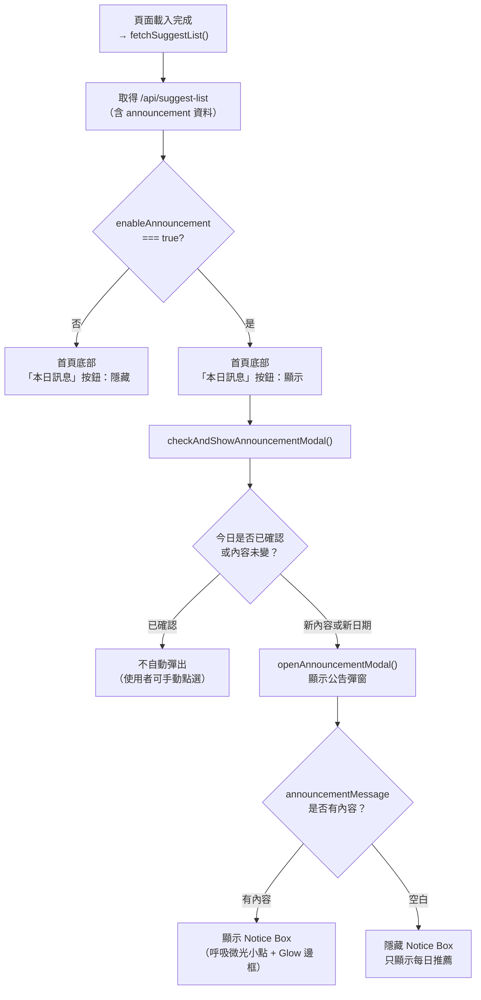

**確認機制（localStorage）：**
- Key: `mdWebview-announcement-modal-ack`
- Value: `{dateKey: 'YYYY-MM-DD', updatedAt: timestamp, itemsSig: hash}`
- 當日期、公告更新時間或推薦清單有任何變化時，強制重新顯示

---

## 7. 使用者偏好與排版控制

為提供無干擾、客製化且安全的閱讀體驗，`app.js` 提供「使用者偏好設定」彈窗（包含「外觀主題」與「視覺排版」兩大分頁，以及整合之「備份與還原」功能）：

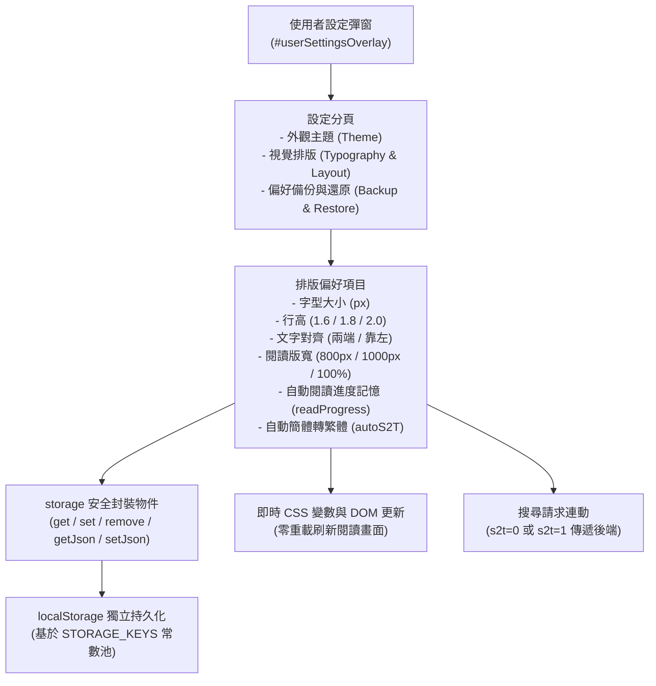

### 7.1 集中式常數池與安全儲存封裝

為消除散落硬編碼（Magic Strings）並防止無痕瀏覽模式、Storage Quota 爆滿或損毀 JSON 導致程式崩潰，前端全面採用集中化儲存機制：

#### 1. STORAGE_KEYS 常數池
| 鍵值常數 | 實際 localStorage 鍵值 | 說明 |
|---------|------------------------|------|
| `THEME` | `mdWebview-user-theme` | 外觀主題 ID（obsidian-dark, obsidian-light 等） |
| `FONT_SIZE` | `mdWebview-user-fontsize` | 使用者設定字體大小（數值 px） |
| `TEXT_ALIGN` | `mdWebview-user-textalign` | 文字對齊（`justify` 或 `left`） |
| `LINE_HEIGHT` | `mdWebview-user-lineheight` | 行高倍率（`1.6`, `1.8`, `2.0`） |
| `MAX_WIDTH` | `mdWebview-user-maxwidth` | 閱讀容器最大寬度（`800px`, `1000px`, `100%`） |
| `AUTO_S2T` | `mdWebview-auto-s2t` | 自動簡轉繁開關（`'true'` 或 `'false'`） |
| `READ_PROGRESS_ENABLED` | `mdWebview-user-readprogress` | 是否啟用自動記錄/恢復閱讀進度 |
| `LAST_READ_PROGRESS` | `mdWebview-last-read-progress` | 最近閱讀經文路徑與行號錨點 |
| `RECENT_FILES` | `mdWebview-user-recentfiles` | 最近開啟經文清單（上限 20 筆 JSON） |
| `BOOKMARKS` | `mdWebview-user-bookmarks` | 書籤清單（JSON 陣列 `{path, title, line, ts}`） |
| `ADMIN_TOKEN` | `mdWebview-admin-token` | 後台管理員 Session Bearer Token |
| `ADMIN_TZ` | `mdWebview-admin-tz` | 管理員後台報表指定顯示時區 |
| `DICT_FILE_ORDER` | `mdWebview-dict-file-order` | 辭典顯示順序偏好清單 |
| `DICT_FILE_SELECT` | `mdWebview-dict-selected` | 當前選中辭典索引標籤 |
| `FORCE_FULL` | `mdWebview-force-full` | 虛擬化超大經文強制全量展開旗標 |
| `SEARCH_MODE` | `mdWebview-search-mode` | 全文搜尋模式偏好（`'loose'` 或 `'strict'`） |
| `ANNOUNCEMENT_ACK` | `mdWebview-announcement-modal-ack` | 今日公告已確認紀錄簽章 |

#### 2. storage 防例外包裝工具
- `storage.get(key, fallback)`：內建 try-catch，無拋錯讀取字串。
- `storage.set(key, val)`：寫入安全包裝，捕獲 `QuotaExceededError` 並回傳 boolean。
- `storage.remove(key)`：安全移除項目。
- `storage.getJson(key, fallback)`：解析 JSON，語法錯誤或非預期格式時自動降級回傳 fallback。
- `storage.setJson(key, val)`：自動序列化為 JSON 字串並持久化。

### 7.2 偏好備份與還原機制

- **備份匯出**：於設定彈窗點擊「匯出設定」，將使用者閱讀偏好（含 `searchMode` 全文搜尋模式）、最近閱讀歷史、書籤與外觀打包為標準 JSON 下載（`mdwebview-preferences-YYYY-MM-DD.json`）。
- **資安防護**：匯出程序**嚴格剔除** `STORAGE_KEYS.ADMIN_TOKEN` 與敏感授權資料，確保使用者備份檔案不慎外流時無任何資安風險。
- **還原驗證與向下相容**：支援拖曳或上傳 JSON 檔案，進行結構合法性檢查後原子化覆蓋偏好並即時刷新介面；`searchMode` 經值驗證（只接受 `'loose'` 或 `'strict'`）後還原，若舊備份檔無此欄位則維持現狀，具備完全向下相容性。
- **UI 整合淨化**：移除舊版位於 UI 底部左下角的重複「下載備份」按鈕，統一集中由「使用者設定」彈窗掌管，維持首頁與閱讀介面的乾淨簡約。

---

## 8. 後端模組架構與 API 路由索引

後端採用 **原生 CommonJS 模組解耦架構**，無任何外部第三方 HTTP 框架（如 Express/Fastify）。`server.js` 作為頂層組裝入口，所有重型與專項業務邏輯抽離至 `lib/` 目錄下的原生模組。

### 8.1 lib/ 原生模組職責劃分

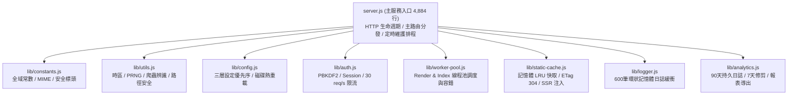

| 模組檔案 | 核心職責 | 主要導出方法與物件 |
|---------|---------|-------------------|
| `lib/constants.js` | 集中定義系統全域常數、MIME 類型、安全性 HTTP 標頭與版本資訊 | `APP_ROOT`, `PORT`, `CONFIG_PATH`, `APP_VERSION`, `MAX_LOG_BUFFER`, `CRAWLER_UA_REGEX`, `LOG_DIR`, `ANALYTICS_STORE_PATH`, `MIME_TYPES`, `SECURITY_HEADERS` |
| `lib/utils.js` | 零依賴通用公用函數：字串跳脫、時區轉換、PRNG、安全解碼與路徑遍歷防護 | `escapeXml`, `formatTimestampInTz`, `mulberry32`, `getCrawlerName`, `isCrawlerRequest`, `isBotEntry`, `extractAnalyticsPath`, `getRootRealpath`, `isRealPathWithinRoot`, `flattenMarkdownFiles`, `getClientIP`, `getBaseUrl`, `safeDecodeURI`, `safeDecodeURIComponent` |
| `lib/config.js` | 系統設定生命週期管理：3 層優先序載入、原子儲存、`fs.watch` 熱重載、Markdown/辭典根路徑解析與記憶化快取 | `config`, `loadConfig`, `saveConfig`, `setupConfigWatcher`, `resetConfigWatcher`, `getMdRoot`, `deriveDictRoot`, `getDictionaryPath`, `invalidateMdRootMemo`, `isRealPathWithinMdRoot` |
| `lib/auth.js` | 身分安全與存取控制：PBKDF2 密碼雜湊、時序安全比對、6h Session 管理、滑動視窗 API 限流（30 req/s）、CSRF 同源驗證 | `sessions`, `SESSION_DURATION`, `loginAttempts`, `checkApiRateLimit`, `timingSafeCompare`, `hashPassword`, `generateSessionToken`, `verifySameOrigin`, `isAuthenticated`, `readJSONBody` |
| `lib/worker-pool.js` | 背景 Worker Thread 池生命週期調度：Render Pool 與 Index Pool 管理、Backpressure 佇列上限、逾時熔斷重生、指數退避防 Crash Loop | `workerPool`, `indexWorkerPool`, `initWorkerPool`, `initIndexWorkerPool`, `renderWithWorker`, `executeIndexJob`, `runIndexWorkerPool`, `terminateWorkerPools` |
| `lib/analytics.js` | 訪客統計與行為日誌：90 天持久化存取紀錄、7 天自動修剪排程、動態指標即時聚合、時區校正查詢、CSV/JSON 匯出 | `analyticsStore`, `getLogFilePath`, `appendToPersistentLog`, `updateAnalyticsStoreEntry`, `saveAnalyticsStore`, `initializeAnalyticsStore`, `cleanOldLogsJob`, `buildAggregateAnalyticsData`, `getAnalyticsData`, `parseAnalyticsRange`, `setInMemoryLogBufferRef` |
| `lib/logger.js` | 記憶體結構化系統日誌：600 筆環狀緩衝（Ring Buffer）、後台 API 輸出、標準控制台日誌封裝 | `systemLogBuffer`, `pushToLogBuffer`, `Logger` (`info`, `warn`, `error`) |
| `lib/static-cache.js` | 靜態資產快取與 SSR 注入：記憶體 LRU 快取（5s TTL）、If-None-Match 304 快速協商、Gzip 壓縮、首頁動態 SSR 注入 | `serveStatic`, `staticCache`, `sendCompressed`, `sendJSON`, `indexHtmlHeaders`, `escapeHtmlString`, `safeJsonForScript`, `getIndexHtml` |
| `lib/markdown.js` | Markdown 與 Frontmatter 文本處理：YAML 標頭剝離、metadata 解析與行號偏移 (lineOffset) 計算 | `stripFrontmatter` |

### 8.2 server.js API 路由索引表

`server.js` 負責核心請求攔截、路由分派以及搜尋/章節索引之調度：

| 路徑 | Method | Handler / 關聯模組 | 需要 Auth | 說明 |
|------|--------|-------------------|-----------|------|
| `/` | GET | `getIndexHtml()` (`lib/static-cache.js`) | ❌ | SPA 首頁（SSR 動態注入 siteName、主題、設定） |
| `/manifest.json` | GET | `handleManifestJson()` | ❌ | PWA Web App Manifest（動態站名） |
| `/robots.txt` | GET | `handleRobotsTxt()` | ❌ | SEO 搜尋引擎檢索指令 |
| `/sitemap.xml` | GET | `handleSitemapXml()` | ❌ | SEO 站點地圖（20s 沉降防抖 + Stale 快取） |
| `/api/tree` | GET | `handleTree()` | ❌ | 取得經論 Markdown 目錄樹（支援快取與熱失效） |
| `/api/file` | GET | `handleFile()` | ❌ | 取得經論 .md 原文內容 |
| `/api/media` | GET | `handleMedia()` | ❌ | 靜態媒體服務（圖片、PDF、音訊，支援 Range） |
| `/api/render` | GET | `handleRender()` | ❌ | 經文渲染 API（小型檔案完整渲染並提取 Meta） |
| `/api/section-index` | GET | `handleSectionIndex()` | ❌ | 大型經論與辭典章節分塊 Metadata (.bin 磁碟快取) |
| `/api/render-chunk` | GET | `handleRenderChunk()` | ❌ | 大型經論特定分塊動態渲染（Worker 調度） |
| `/api/search` | GET | `handleSearch()` | ❌ | Bigram 全文倒排檢索（支援 s2t 簡繁轉換、mode=strict|loose 寬鬆模式與鄰近過濾） |
| `/api/search-file` | GET | `handleSearchFile()` | ❌ | 單一經論檔案內文檢索 |
| `/api/file-search` | GET | `handleFileSearch()` | ❌ | 檔案名稱快速模糊檢索 |
| `/api/page-search` | GET | `handlePageSearch()` | ❌ | 頁內全文檢索輔助 |
| `/api/dict-headwords` | GET | `handleDictHeadwords()` | ❌ | 辭典詞條倒排索引資料 |
| `/api/dict-search` | GET | `handleDictSearch()` | ❌ | 佛學辭典多模式搜尋（前綴 / 全文） |
| `/api/dict-event` | POST | `handleDictEvent()` | ❌ | 辭典查閱行為日誌 Beacon |
| `/api/dict-files` | GET | `handleDictFiles()` | ❌ | 辭典來源檔案清單 |
| `/api/suggest-list` | GET | `handleSuggestList()` | ❌ | 首頁推薦經論、熱門榜與每日單詞 |
| `/api/admin/setup` | POST | 伺服器首次管理員初始化 | ❌ | 首次部署管理員帳號與 siteUrl 設定 |
| `/api/admin/login` | POST | PBKDF2 驗證 (`lib/auth.js`) | ❌ | 管理員登入（防暴力破解鎖定 15m） |
| `/api/admin/logout` | POST | Session 註銷 (`lib/auth.js`) | ✅ | 登出並使 Token 失效 |
| `/api/admin/status` | GET | 狀態偵測 | ❌ | 檢查系統是否已初始化及管理員認證狀態 |
| `/api/admin/settings` | GET | 讀取設定 (`lib/config.js`) | ✅ | 取得當前伺服器 config.settings |
| `/api/admin/settings` | POST | 儲存設定 (`lib/config.js`) | ✅ | 更新系統設定、目錄路徑與 SEO 參數 |
| `/api/admin/logs` | GET | 系統日誌 (`lib/logger.js`) | ✅ | 讀取 600 筆環狀記憶體日誌 |
| `/api/admin/analytics` | GET | 報表查詢 (`lib/analytics.js`) | ✅ | 依時區聚合讀取訪問量、PV/UV、熱門排行 |
| `/api/admin/analytics/export`| GET | 報表匯出 (`lib/analytics.js`)| ✅ | 匯出結構化 CSV 或 JSON 格式分析資料 |
| `/api/admin/hardware` | GET | `handleHardwareStats()` | ✅ | 取得伺服器硬體負載（CPU、RAM、Uptime） |
| `/api/admin/rebuild-index` | POST | `handleRebuildIndex()` | ✅ | 手動觸發非同步重建 Bigram 搜尋索引 |
| `/api/admin/rebuild-dict-index`| POST| `handleRebuildDictIndex()` | ✅ | 手動觸發非同步重建辭典倒排索引 |
| `/api/admin/rebuild-sitemap`| POST | `handleAdminRebuildSitemap()`| ✅ | 強制手動立即重新生成 Sitemap |
| `/api/admin/clear-cache` | POST | `handleAdminClearCache()` | ✅ | 清除記憶體靜態快取與搜尋暫存 |
| `/api/admin/password` | POST | `handleAdminPassword()` | ✅ | 更新管理員登入密碼 |
| `/api/admin/diagnose-path`| POST | `handleAdminDiagnosePath()` | ✅ | 檢測經論與辭典磁碟路徑可讀性 |
| `/api/admin/seo-stats` | GET | SEO 統計資訊 | ✅ | 取得目前 Sitemap、Robots 與經論統計數 |
| `/*` (靜態資源) | GET | `serveStatic()` (`lib/static-cache.js`) | ❌ | 靜態檔案（HTML, CSS, JS, 字型, 圖片） |

> [!NOTE]
> - 所有 `/api/*` 路由均受 Global Rate Limiter 保護（30 req/s per IP，滑動視窗）。
> - 管理員 API 需通過 `verifySameOrigin` CSRF 同源驗證，並攜帶有效 session token（`Authorization: Bearer <token>` 或 `X-Admin-Token`）。

---

## 9. app.js 前端架構與 State 物件說明

前端單頁應用採用無編譯純 JavaScript（ES6+）IIFE 封裝，依職責劃分為 24 個邏輯段落（§0-§23）。

### 9.1 段落索引與通用 Helper

#### 1. 邏輯段落分區表（Section Map）
| 段落編號 | 核心模組 | 職責與功能概述 |
|---------|---------|---------------|
| `§0` | Globals & State | 全域集中 `STORAGE_KEYS`、`storage` 安全封裝、LRU 快取、`state` 物件 |
| `§1` | Init & Boot Hooks | `loadSettings()`、`initUI()`、URL 參數解析 |
| `§2` | Site Name & Footer | 站台名稱即時更新、頁尾版本與公告控制 |
| `§3` | Suggest List | 首頁推薦經論、熱門榜與每日單詞（PRNG 輪換） |
| `§4` | Announcement Modal | 公告訊息彈窗顯示與今日已讀簽章驗證 |
| `§5` | File Tree | 經論目錄樹建置、過濾、排序與非同步渲染 |
| `§6` | Markdown Viewer | 小型經論渲染、標題錨點、雙向註腳跳轉、Wikilink |
| `§7` | Wikilink Resolver | 內部經文雙鏈快速跳轉與索引比對 |
| `§8` | Table of Contents | 大綱目錄生成、ScrollSpy 滾動追蹤高亮 |
| `§9` | Global Search | Bigram 全文搜尋、分批渲染（300筆/批）防介面凍結 |
| `§10` | Dictionary Sidebar | 佛學辭典抽屜、前綴與全文檢索、分詞查閱 |
| `§11` | In-Page Search (Ctrl+F) | 頁內即時高亮搜尋與跳轉 |
| `§12` | Theme | 主題切換與即時 CSS 變數套用 |
| `§13` | Font Size | 字體大小即時縮放與持久化 |
| `§14` | Text/Layout Preferences | 對齊、行高、閱讀版寬、簡繁轉換開關 |
| `§15` | Recent Files | 最近閱讀經文紀錄（最多 20 筆） |
| `§16` | Toast Notifications | 全域浮動提示通知（showToast） |
| `§17` | Bookmarks | 經本書籤收藏管理 |
| `§18` | Read Progress | 閱讀進度二分搜尋測量與自動恢復 |
| `§19` | Sidebar Resize | 側邊欄拖曳調整寬度 |
| `§20` | Event Listeners | 快捷鍵、全域點擊、popstate 路由監聽 |
| `§21` | Admin Panel | 後台管理面板 UI、設定表單、圖表與日誌 |
| `§22` | Utilities | 通用轉義、時區格式化、通用 Helper |
| `§23` | Boot Entry | DOMContentLoaded 初始化啟動入口 |

#### 2. 前端通用 Helper
- `isNarrowScreen()`：整合行動裝置 User-Agent 識別與 `window.innerWidth <= 768` 判斷，全站統一響應式邊界判斷。
- `getTodayDateIso()`：取得 ISO 格式今日日期字串（`YYYY-MM-DD`），用於公告 ack 比對與日誌校驗。
- `log`：統一前端彩色控制台日誌工具（`info`, `warn`, `error`）。

### 9.2 State 物件欄位一覽

`state` 是 `app.js` 的單一全域狀態物件（IIFE 內部，非 window 全域）：

| 欄位 | 型別 | 說明 |
|------|------|------|
| `currentFile` | `string|null` | 當前開啟的檔案路徑（`null` = 首頁歡迎畫面） |
| `currentTheme` | `string` | 主題 ID：`obsidian-dark`|`obsidian-light`|`solarized`|`zen`|`gruvbox` |
| `defaultFontSize` | `number` | 伺服器設定的預設字體大小（px），作為重置基準 |
| `fontSize` | `number` | 當前閱讀字體大小（px），使用者可調整 |
| `textAlign` | `string` | 文字對齊：`justify`|`left` |
| `lineHeight` | `string` | 行高倍數字串：`'1.6'`|`'1.8'`|`'2.0'` |
| `maxWidth` | `string` | 閱讀區最大寬度 CSS 值，行動版預設 `95%`，桌面版 `800px` |
| `autoReadProgress` | `boolean` | 是否自動儲存/恢復閱讀進度 |
| `autoS2T` | `boolean` | 是否自動將簡體中文轉換為繁體中文（全站預設 `false`，儲存於 localStorage） |
| `isMobile` | `boolean` | 是否為行動裝置（UA 或視窗寬度 ≤ 768px） |
| `siteName` | `string` | 站台名稱，來自 `config.settings.siteName`，預設 `'mdWebview'` |
| `treeData` | `Array|null` | 檔案樹 JSON（`null` = 尚未從 `/api/tree` 載入） |
| `fileSort` | `string` | 檔案排序：`name-asc`|`name-desc`|`modified-asc`|`modified-desc` |
| `fileSizes` | `Map` | `filePath → bytes`，用於判斷是否需要虛擬化渲染 |
| `recentFiles` | `string[]` | 最近開啟的檔案路徑（最多 20 筆，持久化於 localStorage） |
| `bookmarks` | `Object[]` | 書籤列表 `{path, title, line, ts}`，持久化於 localStorage |
| `sidebarTab` | `string` | 側邊欄分頁：`'files'`|`'search'`|`'toc'` |
| `sidebarCollapsed` | `boolean` | 側邊欄是否已收合 |
| `pageSearchMatches` | `Object[]` | 頁內搜尋（Ctrl+F）的命中節點列表 |
| `pageSearchIndex` | `number` | 當前高亮命中索引（`-1` = 無） |
| `pageSearchQuery` | `string|null` | 最後一次頁內搜尋關鍵詞 |
| `searchSort` | `string` | 搜尋結果排序：`relevance`|`file-asc`|`file-desc`|`count-desc` |
| `searchMode` | `'loose'|'strict'` | 當前全文搜尋模式（優先讀取 localStorage 偏好，fallback 至 `appConfig.defaultSearchMode`，預設 `'loose'`） |
| `lastSearchData` | `Object|null` | 最後搜尋回傳資料（換頁排序時不重新請求） |
| `searchRenderLimit` | `number` | 已渲染的搜尋結果筆數（分批渲染計數） |
| `scrollSpyObserver` | `IntersectionObserver|null` | TOC 高亮用的 IntersectionObserver |
| `scrollSpyHandler` | `Function|null` | scroll 事件 handler 參考（用於移除） |
| `scrollSpyResizeHandler` | `Function|null` | resize 事件 handler 參考 |
| `scrollSpyRaf` | `number|null` | requestAnimationFrame ID |
| `refreshScrollSpy` | `Function|null` | 重新初始化 ScrollSpy 的函數參考 |
| `virtual` | `Object|null` | 大型檔案虛擬化狀態（`null` = 非虛擬化模式）。結構：`{si, chunks, currentChunk, totalEntries, visibleStart, visibleEnd}` |
| `sectionIndexCache` | `Map` | `filePath → {etag, si}` 的 section index 快取 |
| `dictionaryEnabled` | `boolean` | 後台是否啟用辭典功能 |
| `dictHeadwords` | `Object|null` | 辭典詞條索引（由 `/api/dict/headwords` 載入） |
| `dictIndex` | `Object|null` | 當前辭典條目詳情 |
| `dictSelected` | `string|null` | 當前查詢的辭典詞條 |
| `dictFileOrder` | `string[]|null` | 辭典檔案顯示順序 |
| `dictSidebarOpen` | `boolean` | 辭典側邊欄是否開啟 |
| `dictMode` | `string` | 查詢模式：`'prefix'`（前綴）|`'fulltext'`（全文） |
| `dictAbortController` | `AbortController|null` | 取消進行中辭典請求 |
| `dictFulltextCache` | `Object|null` | 辭典全文搜尋快取（避免重複請求） |
| `dictFulltextScrollTop` | `number` | 辭典全文搜尋結果的滾動位置 |
| `dictSidebarWidth` | `number|null` | 辭典側邊欄寬度（px），使用者可拖拉調整 |
| `dictHeadwordsETag` | `string|null` | 辭典 headwords 的 ETag（用於 304 Not Modified） |
| `dictPollTimer` | `number|null` | 辭典輪詢 timer ID（檢查辭典更新） |
| `adminToken` | `string|null` | 管理員 session token（持久化於 localStorage） |
| `_announcementModalContext` | `Object|null` | 公告彈窗最後開啟時的資料快照（用於判斷是否重複顯示） |
| `_cachedSuggestItems` | `Object[]|null` | 最後一次 `/api/suggest-list` 的推薦項目快取 |

---

## 10. config.json 設定欄位一覽

儲存路徑（優先順序高 → 低）：
1. `CONFIG_PATH` 環境變數（預設 `APP_ROOT/config.json`，Docker 中為 `/data/config.json`）
2. `APP_ROOT/config.json`（本地開發）
3. 環境變數（`PORT`、`MD_ROOT`、`SITE_NAME`…）

| 欄位 | 型別 | 預設值 | 環境變數 | 說明 |
|------|------|--------|----------|------|
| `settings.mdRoot` | `string` | `./md` | `MD_ROOT` | Markdown 文件庫根目錄 |
| `settings.defaultFontSize` | `number` | `16` | `DEFAULT_FONT_SIZE` | 預設閱讀字體大小（px） |
| `settings.defaultTheme` | `string` | `'obsidian-dark'` | `DEFAULT_THEME` | 預設主題 ID |
| `settings.siteName` | `string` | `'mdWebview'` | `SITE_NAME` | 站台名稱（影響 title、OG、manifest、UI） |
| `settings.siteUrl` | `string` | `''` | `SITE_URL` | 站台 URL（用於 canonical、OG 絕對路徑） |
| `settings.enableVersion` | `boolean` | `false` | `ENABLE_VERSION` | 是否在首頁底部顯示版本號 |
| `settings.version` | `string` | `''` | `VERSION` | 自訂版本標籤（如 `'2026-5'`） |
| `settings.enableDownload` | `boolean` | `false` | `ENABLE_DOWNLOAD` | 是否在首頁底部顯示下載連結 |
| `settings.downloadUrl` | `string` | `''` | `DOWNLOAD_URL` | 下載連結 URL |
| `settings.dictionaryEnabled` | `boolean` | `false` | `DICTIONARY_ENABLED` | 是否啟用辭典側邊欄 |
| `settings.dictionaryPath` | `string` | `./dicts` | `DICTIONARY_PATH` | 辭典目錄路徑 |
| `settings.enableAnnouncement` | `boolean` | `false` | `ENABLE_ANNOUNCEMENT` | 是否開啟公告訊息彈窗（同時控制底部「本日訊息」按鈕顯示） |
| `settings.announcementMessage` | `string` | `''` | `ANNOUNCEMENT_MESSAGE` | 公告訊息文字（空白 = 只顯示每日推薦） |
| `settings.announcementUpdatedAt` | `number` | `0` | — | 公告最後更新時間戳（ms，用於觸發使用者重新顯示） |
| `settings.timezone` | `string` | `'auto'` | — | Analytics 時區（`'auto'` 或 IANA 時區，如 `'Asia/Taipei'`） |
| `settings.maxProximityDistance` | `number` | `150` | — | 全文搜尋鄰近詞距上限（字元數） |
| `settings.defaultSearchMode` | `string` | `'loose'` | `DEFAULT_SEARCH_MODE` | 全站預設全文搜尋模式（`'loose'` 或 `'strict'`），管理員可於後台調整 |
| `settings.suggestList.enabled` | `boolean` | `false` | — | 是否啟用首頁推薦清單 |
| `settings.suggestList.adminList` | `string[]` | `[]` | — | 管理員指定推薦的檔案路徑 |
| `settings.suggestList.adminPickCount` | `number` | `3` | — | 從 adminList 隨機顯示的數量 |
| `settings.suggestList.hotPickCount` | `number` | `5` | — | 從熱門清單顯示的數量 |
| `settings.suggestList.blackList` | `string[]` | `[]` | — | 排除不顯示的路徑 glob（支援 `*`） |
| `settings.suggestList.dailyWordCount` | `number` | `3` | — | 每日法語詞條顯示數量 |
| `settings.suggestList.dailyWordDicts` | `string[]` | `[]` | — | 每日法語來源辭典清單 |
| `settings.suggestList.dailyWordRotateHour` | `number` | `12` | — | 每日法語輪換時間（小時，0-23） |
| `admin.username` | `string` | — | — | 管理員帳號 |
| `admin.passwordHash` | `string` | — | — | PBKDF2 密碼雜湊 |
| `admin.salt` | `string` | — | — | PBKDF2 salt（hex） |

---

## 11. 關鍵常數速查

### 後端常數（lib/constants.js & server.js）

| 常數 | 定義位置 | 值 | 說明 |
|------|---------|-----|------|
| `NODE_OPTIONS` | `Dockerfile` / `docker-compose.yml` | `--max-old-space-size=6144` | V8 記憶體堆疊上限（可由 `NODE_MAX_OLD_SPACE_MB` 調校） |
| `PORT` | `lib/constants.js` | `8330`（env `PORT`） | HTTP 服務監聽埠號 |
| `APP_VERSION` | `lib/constants.js` | `'3.6.9'` | 應用程式當前核心版本號 |
| `MAX_LOG_BUFFER` | `lib/constants.js` | `600` | 記憶體系統日誌環狀緩衝上限筆數 |
| `MAX_STATIC_CACHE_ENTRIES`| `lib/constants.js` | `500` | 靜態資源記憶體 LRU 快取上限筆數 |
| `STATIC_CACHE_TTL_MS` | `lib/constants.js` | `5,000`（5s） | 靜態資源快取有效時間（TTL） |
| `POOL_SIZE` | `lib/worker-pool.js` | `max(2, CPU-1)` | Markdown SSR 渲染 Worker Thread 池大小 |
| `INDEX_POOL_SIZE` | `lib/worker-pool.js` | `max(2, min(4, CPU-1))` | Bigram 索引 Worker Thread 池大小 |
| `RENDER_QUEUE_MAX` | `lib/worker-pool.js` | `POOL_SIZE * 8` | Markdown 渲染工作佇列上限（超限即時回 503 防 OOM） |
| `INDEX_QUEUE_MAX` | `lib/worker-pool.js` | `INDEX_POOL_SIZE * 8` | 索引工作佇列上限（超限即時回 503 防 OOM） |
| `WORKER_TIMEOUT_MS` | `lib/worker-pool.js` | `30,000`（30s） | Worker 單工逾時（入列即計時，逾時抽離並重啟 Worker） |
| `LARGE_FILE_MIN_BYTES` | `server.js` | `1,048,576`（1MB） | 觸發虛擬化章節分塊渲染的檔案大小門檻 |
| `MAX_ANALYTICS_KEYS` | `lib/analytics.js` | `10,000` | Analytics 記憶體 Map 最大 key 數（防記憶體爆炸） |
| `SESSION_DURATION` | `lib/auth.js` | `21,600,000`（6h） | 管理員 session 有效存活時間 |
| `MAX_ATTEMPTS` | `lib/auth.js` | `5` | 管理員密碼錯誤次數上限（超限觸發鎖定） |
| `LOCK_DURATION` | `lib/auth.js` | `900,000`（15m） | 登入失敗鎖定時間（15 分鐘） |
| `SEARCH_CACHE_MAX` | `server.js` | `30` | 全文搜尋結果快取最大筆數 |
| `SITEMAP_DEBOUNCE_MS` | `server.js` | `20,000`（20s） | Sitemap 檔案變更沉降防抖延遲時間 |
| `server.requestTimeout`| `server.js` | `30,000`（30s） | HTTP 請求整體處理逾時（防止 Socket 永久懸置） |
| `server.headersTimeout`| `server.js` | `10,000`（10s） | HTTP 標頭接收逾時（防止 Slowloris 攻擊） |

### 前端常數（app.js）

| 常數 | 值 | 說明 |
|------|-----|------|
| `LARGE_FILE_MIN_BYTES` | `1,048,576`（1MB） | 同後端；決定是否進入虛擬化切片模式 |
| `SEARCH_RENDER_BATCH` | `300` | 搜尋結果分批渲染每批筆數（防 DOM 凍結） |
| `CACHE_MAX` | `10` | 經文渲染 LRU 快取最大筆數 |
| `STORAGE_KEYS` | 物件（16 組常數） | 全站統一 LocalStorage 鍵值常數池，消除散落字串 |

---

## 12. Worker Thread 架構

mdWebview 使用兩組獨立的 Worker Thread Pool，各司其職，具備嚴格的並行防護與容錯機制：

### Render Worker Pool（`render-worker.js`）

- **用途**：Markdown 解析與 HTML 渲染（含腳注錨點、Wikilink 轉換、KaTeX、Mermaid 佔位符）
- **工作模式**：job queue + callback map；主線程發送 `{jobId, body, filePath, lineOffset}`，Worker 回傳 `{jobId, html}`
- **池大小**：`max(2, CPU - 1)`
- **佇列長度上限（Backpressure）**：最大上限為 `POOL_SIZE * 8`，溢出時即時回應 HTTP 503 Service Unavailable，杜絕未飽和 Markdown 字串線性灌爆 RSS。
- **入列即計時與超時保護**：任務一進入佇列即啟動 30s 逾時計時器；若逾時且仍在排隊，主動自佇列抽離並 reject；若正在 Worker 運算則終止並重生 Worker。
- **連線中斷取消（Client Abort）**：支援 `req.on('close')`，使用者切換頁面或中斷連線時自動取消排隊中任務。
- **防 Crash Loop 退避重啟**：監控 Worker 異常 exit 事件，15 秒內若連續重啟超過 8 次自動觸發指數退避延遲，避免 Worker 崩潰風暴耗盡系統資源。

### Index Worker Pool（`index-worker.js`）

- **用途**：Bigram 全文倒排索引的建立與搜尋（共用 `lib/text.js`）
- **工作模式**：非同步 job 分發；支援 `section`（章節解析）、`index-build-file`（建立標點透明 Bigram 索引）、`search-scan`（內文掃描，支援 `ignorePunct` 寬鬆模式）任務
- **池大小**：`max(2, min(4, CPU - 1))`
- **單飛重建互斥旗標（Single-flight Rebuild）**：檔案變更防抖與管理員強制重建共用單飛旗標（`searchIndex.building` 與 `searchIndexRebuildPending`），杜絕並行重建引發 2× 峰值記憶體與 `.bin` 暫存檔寫入衝突。
- **二進位索引緩衝區防禦**：載入 `.bin` 磁碟快取時嚴格驗證緩衝區位元組長度與條目數量邊界，防範損毀檔案觸發 OOM。
- **兩個獨立索引**：
  - 主庫索引（`md/` 目錄）
  - 辭典索引（`dicts/` 目錄）—— 獨立、有獨立 LRU 快取，不受主庫驅逐

---

## 13. 安全性設計

| 機制 | 實作位置 | 說明 |
|------|---------|------|
| **Footnote XSS 雙重消毒 (P0-1)** | `render-worker.js` / `md-worker.js` | 註腳 id 採用 `escapeAttr()`、文字標籤 `escapeHtml()`；註腳內文與組裝後容器全面經 `sanitizeDangerousTags()` 過濾 `<script>`、`<style>`、`<iframe>`、`onerror` 等危險屬性 |
| **畸形 Host 標頭與懸置防禦 (P0-2)** | `server.js` 路由入口 | `new URL` 全面包覆 try/catch（失敗即回 400 Bad Request）；全域 router 設有最終例外捕捉（500）；啟用 `server.requestTimeout = 30s`、`headersTimeout = 10s` 與 `clientError` 事件監聽立即銷毀異常 socket |
| **嚴格 TRUST_PROXY 驗證 (P0-3)** | `server.js` `getClientIP()` | 僅在明確配置 `TRUST_PROXY=true` 或指定 IP 白名單時信任代理標頭，杜絕同 LAN / 內網橋接任意偽造來源 IP 繞過限流 |
| **Analytics 匯出同源保護 (P0-4)** | `server.js` `handleAnalyticsExport` | 所有匯出路徑（包含帶有 `token` 的下載分支）強制執行 `verifySameOrigin(req)` 同源檢查，杜絕 CSRF 跨站竊取日誌 |
| **90 天 Analytics 淘汰修剪 (P1-3)**| `server.js` `cleanOldLogsJob` | 每日 bucket 超過 90 天自動淘汰 (`pruneDailyBuckets`)；對 `ips`、`searches`、`dictSearches`、`dictLookups` 全面套用 `pruneAnalyticsMap`，避免長期運行記憶體洩漏 |
| **非阻塞非同步磁碟 I/O (P1-6)** | `server.js` `scanDirAsync` / `getMdRoot` | `scanDirAsync` 改用非阻塞 `fs.promises.stat`；`getMdRoot()` 加入記憶化快取（變更時失效），避免巨量檔案庫阻塞主事件迴圈 |
| **CSP（內容安全策略）** | `SECURITY_HEADERS` | `default-src 'self'`；per-request nonce 允許唯一的 inline config script |
| **HSTS** | `SECURITY_HEADERS` | `max-age=31536000; includeSubDomains` |
| **X-Frame-Options** | `SECURITY_HEADERS` | `SAMEORIGIN`，防 Clickjacking |
| **Path Traversal 防護** | `serveStaticFile()` | 黑名單（`.git`、`server.js`、`config.json`）+ 白名單副檔名 + `path.relative` 逃逸偵測 |
| **Symlink 逃逸防護** | `isRealPathWithinMdRoot()` | `fs.realpath()` 解析後比較真實路徑是否在 `mdRoot` 內 |
| **管理員密碼** | `api/admin/login` | PBKDF2（`sha256`，iterations=100,000，salt=hex random） |
| **Session 管理** | `sessions Map` | 記憶體 Map；6 小時滾動更新；每 15 分鐘清理過期 token |
| **IP Rate Limiting** | `checkApiRateLimit()` | 每 IP 30 req/s 滑動視窗；超限 HTTP 429 |
| **XSS 防護** | `escapeHtmlString()` | 所有 SSR 注入的設定值均 HTML 轉義 |
| **Bot token 遮蔽** | 存取日誌中介 | URL 中的 `?token=...` 在記錄前自動遮蔽 |

---

## 14. CI/CD 與自動化維護工作流程

專案配備 GitHub Actions 現代化持續整合與部署管線，提供多架構容器化發布與全自動鏡像生命週期維護：

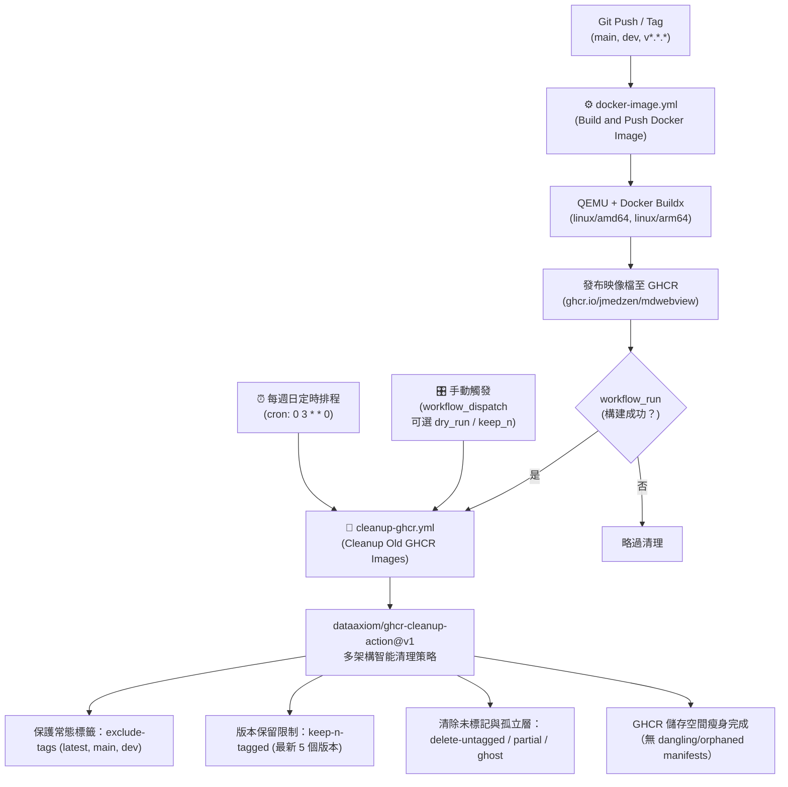

### 工作流程詳細說明

#### 1. 容器映像檔構建與發布 (`.github/workflows/docker-image.yml`)
- **觸發條件**：
  - Push 至 `main` 或 `dev` 分支
  - 發布符合 SemVer 規範的 Git Tag（`v*.*.*`）
  - 手動 `workflow_dispatch`
- **架構特點**：
  - 透過 QEMU 與 Docker Buildx 進行跨架構原生編譯，產出 `linux/amd64` 與 `linux/arm64` 雙架構映像檔。
  - **Tagging 策略**：
    - `main` 分支對應 `latest` 與 `main` 標籤。
    - `dev` 分支對應 `dev` 標籤。
    - Git Tag 對應語意化版本號（如 `v3.6.0`、`3.6.0`）。
  - **快取機制**：採用 GitHub Actions 快取後端（`type=gha`），顯著縮短二度建置耗時。

#### 2. GHCR 舊映像自動修剪維護 (`.github/workflows/cleanup-ghcr.yml`)
- **解決挑戰**：
  - Docker 雙架構映像在 GHCR 中會以 Manifest List 索引多個子架構層（未標記的 untagged manifests）。
  - 若使用原生 API 或一般套件刪除工具，容易留下孤立的子架構層或誤傷有效映像。
- **採用技術**：`dataaxiom/ghcr-cleanup-action@v1`（專為 GHCR 與 Multi-Arch 設計）。
- **清理策略**：
  - **保留最新版本數**：`keep-n-tagged: 5`（預設保留最新的 5 個版本）。
  - **核心標籤豁免**：`exclude-tags: 'latest,main,dev'`，確保首頁部署與核心指標永不被刪除。
  - **深層清理**：啟用 `delete-untagged`、`delete-ghost-images`、`delete-partial-images` 與 `delete-orphaned-images`，徹底清除殘留的中間層與斷頭清單。
- **三重觸發**：
  1. **全自動流水線（`workflow_run`）**：在「Build and Push Docker Image」成功完成後無縫自動接續執行。
  2. **定時排程（`schedule`）**：每週日 UTC 03:00（台北時間 11:00）執行全面深度維護。
  3. **手動測試（`workflow_dispatch`）**：可手動執行，支援勾選 `dry_run`（僅預覽輸出將刪除的 Digest 清單而不執行真實刪除）與自訂保留數量。
- **權限容錯**：配置 `token: ${{ secrets.GHCR_PAT || secrets.GITHUB_TOKEN }}`，優先使用預設工作流程 Token，必要時亦可透過倉庫 Secret `GHCR_PAT` 擴充權限。

---

## 15. 前端高並發與競態防護設計

針對使用者快速連續切換大型經文、非同步搜尋以及長時間閱讀場景，前端 `app.js` 實作以下容錯守衛機制：

| 機制 | 實作位置 | 解決問題與架構細節 |
|------|---------|-------------------|
| **世代守衛 (Generation Guard, P1-9)** | `openFile` / `tryOpenVirtualFile` | 每次進入 `openFile` 自增 `state._openToken`。所有非同步 `await` 返回後及 DOM 置換前，檢驗 `token === state._openToken`。徹底防止點擊慢速未快取檔案 A 後立即點擊已快取檔案 B，造成 A 晚返回覆蓋 B 的競態破壞。 |
| **請求取消與假錯誤消除 (P1-10)** | `openFile` / `fetch` Catch | 連續點擊時主動觸發前次 `_openFileAbort.abort()`；`catch` 區塊首行加入 `if (err.name === 'AbortError') return;`，避免中斷請求在畫面短暫彈出「載入失敗」假錯誤。 |
| **安全 URI 解碼 (P1-11)** | `safeDecodeURIComponent` | 檔案名稱含 `%` 或特殊跳脫符號時，避免直接呼叫原生 `decodeURIComponent` 丟出 `URIError` 中斷流程。 |
| **全域與頁內搜尋取消 (P1-15)** | `performGlobalSearch` / `doPageSearchVirtual` | 支援輸入清除或換詞時即時中止前次搜尋請求，釋放伺服器運算與網路頻寬。 |
| **二分搜尋消除排版卡頓 (P1-16)** | `saveReadProgress` | 避免在萬行經文中對每一行呼叫 `getBoundingClientRect()` 引發嚴重的 Layout Thrashing，改用已快取行號錨點執行二分搜尋（只需 10~15 次量測）。 |
| **大陣列展延堆疊防護 (P1-17)** | `buildVirtualTocItems` / `generateTOC` | 移除 `Math.min(...largeArr)`，改採單次迴圈遍歷，徹底防範大經文目錄深度觸發 RangeError: Maximum call stack size exceeded。 |
| **Service Worker 離線回退 (P2-1)** | `sw.js` Fetch Handler | 當處於完全離線且快取未命中時，回傳明確的 HTTP 504 Gateway Timeout Response 而非丟出未處理的拒絕錯誤；安裝後發送 `SKIP_WAITING` 實現無縫即時生效。 |

---

## 16. CSS 樣式系統與響應式斷點設計

專案採用原生現代 CSS 變數（Custom Properties）與 Flexbox/CSS Grid 系統，樣式經過三階段重構進行了深度的語意化收斂，將原本散落各處的 16 個 `@media` 區塊合併整併為 **7 個語意明確的核心媒體查詢斷點**，並消除無效死規則，確保 CSS 語法階層與大括號嚴格平衡。

### 16.1 媒體查詢斷點分層矩陣

| 斷點條件 | 定義區塊 | 核心職責與適用範圍 |
|---------|---------|-------------------|
| `@media (max-width: 768px)` | L2539 | **主要行動端佈局**：App Shell 轉為單欄、頁首緊湊化、左側目錄/搜尋/大綱抽屜化、全螢幕毛玻璃遮罩（Backdrop）、浮動查詞操作面板自適應、使用者偏好設定彈窗雙欄轉單欄流動佈局 |
| `@media (max-width: 600px)` | L6634 | **公告訊息彈窗**：專屬緊湊視窗適配，縮小 modal padding 與字型大小，按鈕轉為垂直流動排列以防溢出 |
| `@media (max-width: 520px)` | L2892 | **小型螢幕微調**：各類操作按鈕（font-size 調整、複製連結、查詞）縮減內距與邊框，避免在 5.5 吋以下手機出現橫向捲軸 |
| `@media (max-width: 480px)` | L2908 | **極窄手機體驗**：頁首標題自動隱藏或省略（text-overflow）、彈窗關閉按鈕放大觸控熱區、各級標題字級動態縮減 |
| `@media (max-width: 360px)` | L2959 | **超微型裝置自適應**：針對極小手持設備（如 Galaxy Fold 封面螢幕）進行最後一哩字級微調 |
| `@media (max-width: 768px)` (Admin) | L3264 | **管理員後台專屬響應式**：後台面板轉為全螢幕覆蓋模式（100vw × 100vh）、流量分析與硬體圖表表格自動包裹水平滾動容器（`overflow-x: auto`）、系統設定表單轉為流動彈性網格 |
| `@media print` | L2966 | **列印與輸出格式**：隱藏全站導覽列、抽屜、懸浮按鈕、彈窗與背景裝飾；正文轉為高對比黑白排版與自動分頁控制 |

### 16.2 行動端佈局優化與品質保證準則

1. **雙抽屜互斥與單一焦點原則**：
   在 768px 以下行動端，左側檔案樹大綱抽屜與右側辭典抽屜嚴格互斥，展開任一側時自動收合對側並升起 z-index 85 毛玻璃遮罩，防止多層面板交疊導致操作錯亂。
2. **彈窗自適應與彈性流動網格**：
   偏好設定彈窗與後台管理彈窗在桌機端維持居中卡片式呈現（最大寬度 720px~960px）；在 768px 以下自動擴展為全螢幕或自適應 95% 寬度，按鈕群使用 `flex-wrap: wrap` 與 `gap` 排列，杜絕固定寬度破版。
3. **消除無效樣式與嚴格括號平衡**：
   重構過程中全面消除了歷史遺留的重複規則（如重複宣告的 `.seo-stats-box` 與 `.logo-text` 衝突），並由單元測試 `tests/test-css-theme.test.js` 與 `tests/test-mobile-layout-audit.test.js` 嚴格監控 CSS 語法閉合度與行動斷點完整性。

