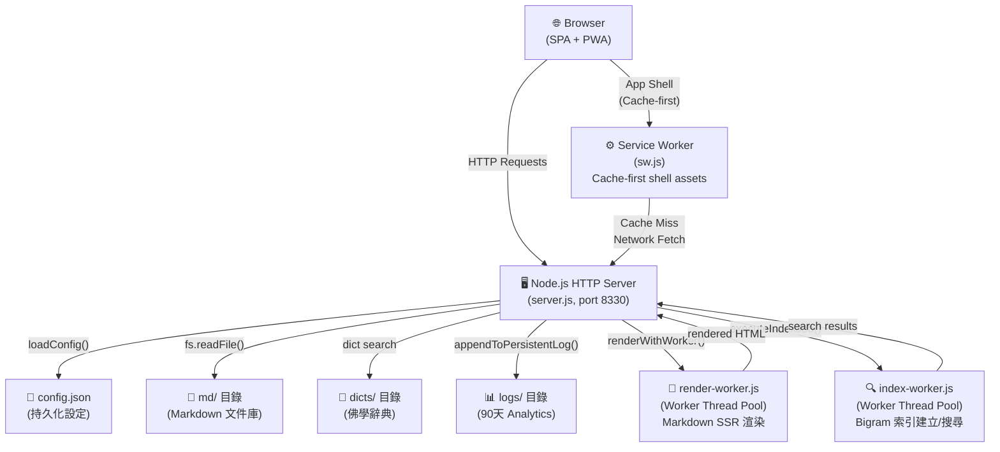
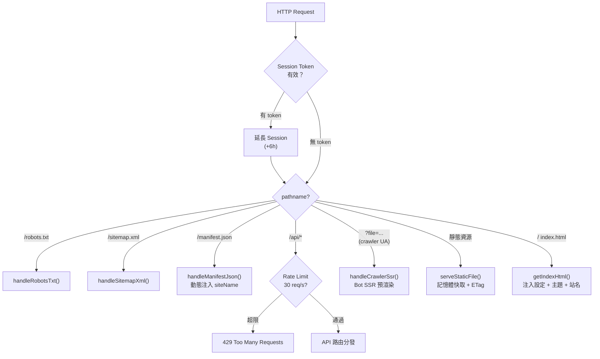
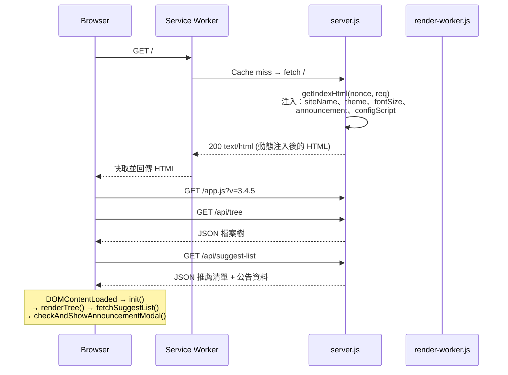
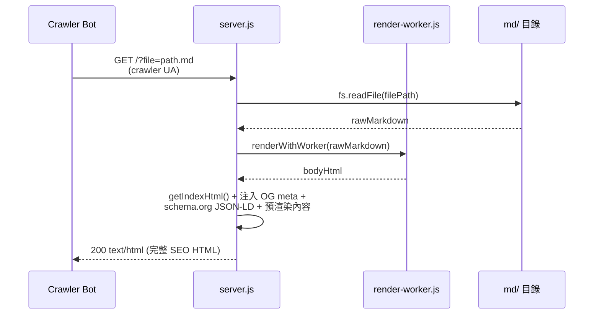
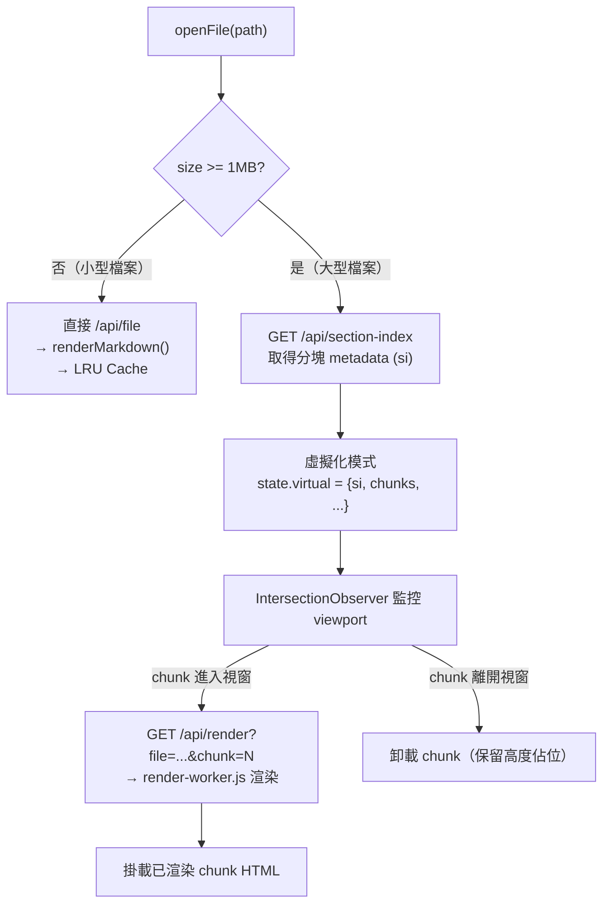
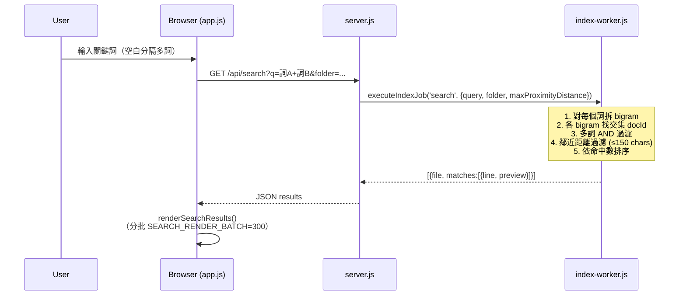
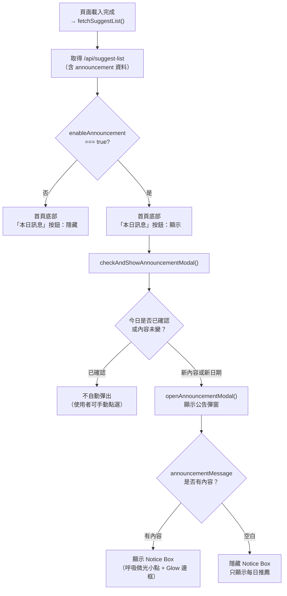

# 🏗️ mdWebview — Architecture Reference

> **目的**：讓 AI 模型與開發者在 **不需要通讀 13,000 行程式碼** 的情況下，快速理解整個系統的架構、資料流與關鍵設計決策。
>
> 版本：v3.5.3 | 最後更新：2026-10

---

## 目錄

1. [系統架構總覽](#1-系統架構總覽)
2. [請求路由決策樹](#2-請求路由決策樹)
3. [資料流：頁面載入](#3-資料流頁面載入)
4. [資料流：大型檔案虛擬化](#4-資料流大型檔案虛擬化)
5. [資料流：全文搜尋](#5-資料流全文搜尋)
6. [公告彈窗顯示邏輯](#6-公告彈窗顯示邏輯)
7. [server.js API 路由索引](#7-serverjs-api-路由索引)
8. [app.js State 物件欄位說明](#8-appjs-state-物件欄位說明)
9. [config.json 設定欄位一覽](#9-configjson-設定欄位一覽)
10. [關鍵常數速查](#10-關鍵常數速查)
11. [Worker Thread 架構](#11-worker-thread-架構)
12. [安全性設計](#12-安全性設計)

---

## 1. 系統架構總覽

**核心設計原則：**
- **單一程序架構**：整個後端為單一 `node server.js` 程序，無 Express/框架依賴
- **Worker Thread Pool**：CPU 密集型工作（Markdown 渲染、Bigram 索引）透過 Worker Thread 池避免阻塞主事件迴圈
- **全非同步 I/O**：所有磁碟存取均採用 Promise-based async/await
- **零外部 CDN**：所有前端庫（marked.js、KaTeX、mermaid）均本地託管

---

## 2. 請求路由決策樹

`server.js` 的主路由分發器依序判斷每個請求：

**Bot 偵測**：符合 `CRAWLER_UA_REGEX` 的 User-Agent 或帶有 `?ssr=1` 參數的請求，自動觸發 SSR 預渲染，回傳完整 HTML（含 schema.org JSON-LD）供搜尋引擎索引。

---

## 3. 資料流：頁面載入

### 一般使用者（SPA）

### 搜尋引擎爬蟲（SSR）

---

## 4. 資料流：大型檔案虛擬化

檔案大小 ≥ **1MB** (`LARGE_FILE_MIN_BYTES`) 時，啟動虛擬化渲染模式：

**section-index 格式**（由 `index-worker.js` 建立）：
- 每個 "entry"（如辭典詞條）的起止行號與位元組偏移
- 用於辭典條目導航（`entryNav` prev/next）與精確分塊邊界

---

## 5. 資料流：全文搜尋

**Bigram 索引架構：**
- **建立時機**：首次搜尋時 lazy build，之後快取（記憶體 + `.bin` 二進位磁碟快取）
- **辭典索引**：獨立於主庫索引，避免辭典大小影響主庫搜尋速度
- **索引格式**：`bigramMap: Map<string, Set<docId>>` 加上 `docStore: Map<docId, {path, content}>`

---

## 6. 公告彈窗顯示邏輯

**確認機制（localStorage）：**
- Key: `mdWebview-announcement-modal-ack`
- Value: `{dateKey: 'YYYY-MM-DD', updatedAt: timestamp, itemsSig: hash}`
- 當日期、公告更新時間或推薦清單有任何變化時，強制重新顯示

---

## 7. server.js API 路由索引

| 路徑 | Method | Handler | 需要 Auth | 說明 |
|------|--------|---------|-----------|------|
| `/` | GET | `getIndexHtml()` | ❌ | SPA 首頁（動態注入設定） |
| `/manifest.json` | GET | `handleManifestJson()` | ❌ | PWA Manifest（動態 siteName） |
| `/robots.txt` | GET | `handleRobotsTxt()` | ❌ | SEO robots |
| `/sitemap.xml` | GET | `handleSitemapXml()` | ❌ | SEO sitemap |
| `/api/tree` | GET | `handleTree()` | ❌ | 取得 Markdown 檔案樹 |
| `/api/file` | GET | `handleFile()` | ❌ | 取得 .md 檔案內容 |
| `/api/media` | GET | `handleMedia()` | ❌ | 取得圖片/音訊/PDF |
| `/api/section-index` | GET | `handleSectionIndex()` | ❌ | 大型檔案分塊 metadata |
| `/api/render` | GET | `handleRender()` | ❌ | 渲染大型檔案某一 chunk |
| `/api/search` | GET | `handleSearch()` | ❌ | Bigram 全文搜尋 |
| `/api/file-search` | GET | `handleFileSearch()` | ❌ | 檔名搜尋 |
| `/api/page-search` | GET | `handlePageSearch()` | ❌ | 頁內 Ctrl+F 搜尋 |
| `/api/dict/headwords` | GET | `handleDictHeadwords()` | ❌ | 辭典詞條索引 |
| `/api/dict/files` | GET | `handleDictFiles()` | ❌ | 辭典檔案清單 |
| `/api/dict/search` | GET | `handleDictSearch()` | ❌ | 辭典全文搜尋 |
| `/api/dict/analytics` | POST | `handleDictAnalytics()` | ❌ | 辭典查詢記錄 beacon |
| `/api/suggest-list` | GET | `handleSuggestList()` | ❌ | 首頁推薦 + 公告資料 |
| `/api/admin/login` | POST | — | ❌ | 管理員登入（PBKDF2 驗證） |
| `/api/admin/logout` | POST | — | ✅ | 登出 |
| `/api/admin/status` | GET | — | ✅ | 管理員狀態 |
| `/api/admin/settings` | GET | — | ✅ | 取得系統設定 |
| `/api/admin/settings` | POST | — | ✅ | 儲存系統設定 |
| `/api/admin/logs` | GET | — | ✅ | 讀取系統日誌 |
| `/api/admin/analytics` | GET | — | ✅ | 讀取 Analytics 資料 |
| `/api/admin/analytics/export` | GET | — | ✅ | 匯出 CSV/JSON |
| `/api/admin/hardware` | GET | — | ✅ | 硬體監控（CPU/RAM） |
| `/api/admin/rebuild-index` | POST | — | ✅ | 強制重建搜尋索引 |
| `/api/admin/change-password` | POST | — | ✅ | 修改管理員密碼 |
| `/api/admin/setup` | POST | — | ❌ | 首次安裝設定管理員 |
| `/*` (static) | GET | `serveStaticFile()` | ❌ | JS/CSS/圖片等靜態資源 |

> [!NOTE]
> 所有 `/api/*` 路由均受 Global Rate Limiter 保護（30 req/s per IP，滑動視窗）。
> 管理員 API 額外需要有效 session token（HTTP `Authorization: Bearer <token>` header）。

---

## 8. app.js State 物件欄位說明

`state` 是 `app.js` 的單一全域狀態物件（IIFE 內部，非 window 全域）：

| 欄位 | 型別 | 說明 |
|------|------|------|
| `currentFile` | `string\|null` | 當前開啟的檔案路徑（`null` = 首頁歡迎畫面） |
| `currentTheme` | `string` | 主題 ID：`obsidian-dark`\|`obsidian-light`\|`solarized`\|`zen`\|`gruvbox` |
| `defaultFontSize` | `number` | 伺服器設定的預設字體大小（px），作為重置基準 |
| `fontSize` | `number` | 當前閱讀字體大小（px），使用者可調整 |
| `textAlign` | `string` | 文字對齊：`justify`\|`left` |
| `lineHeight` | `string` | 行高倍數字串：`'1.6'`\|`'1.8'`\|`'2.0'` |
| `maxWidth` | `string` | 閱讀區最大寬度 CSS 值，行動版預設 `95%`，桌面版 `800px` |
| `autoReadProgress` | `boolean` | 是否自動儲存/恢復閱讀進度 |
| `isMobile` | `boolean` | 是否為行動裝置（UA 或視窗寬度 ≤ 768px） |
| `siteName` | `string` | 站台名稱，來自 `config.settings.siteName`，預設 `'mdWebview'` |
| `treeData` | `Array\|null` | 檔案樹 JSON（`null` = 尚未從 `/api/tree` 載入） |
| `fileSort` | `string` | 檔案排序：`name-asc`\|`name-desc`\|`modified-asc`\|`modified-desc` |
| `fileSizes` | `Map` | `filePath → bytes`，用於判斷是否需要虛擬化渲染 |
| `recentFiles` | `string[]` | 最近開啟的檔案路徑（最多 20 筆，持久化於 localStorage） |
| `bookmarks` | `Object[]` | 書籤列表 `{path, title, line, ts}`，持久化於 localStorage |
| `sidebarTab` | `string` | 側邊欄分頁：`'files'`\|`'search'`\|`'toc'` |
| `sidebarCollapsed` | `boolean` | 側邊欄是否已收合 |
| `pageSearchMatches` | `Object[]` | 頁內搜尋（Ctrl+F）的命中節點列表 |
| `pageSearchIndex` | `number` | 當前高亮命中索引（`-1` = 無） |
| `pageSearchQuery` | `string\|null` | 最後一次頁內搜尋關鍵詞 |
| `searchSort` | `string` | 搜尋結果排序：`relevance`\|`file-asc`\|`file-desc`\|`count-desc` |
| `lastSearchData` | `Object\|null` | 最後搜尋回傳資料（換頁排序時不重新請求） |
| `searchRenderLimit` | `number` | 已渲染的搜尋結果筆數（分批渲染計數） |
| `scrollSpyObserver` | `IntersectionObserver\|null` | TOC 高亮用的 IntersectionObserver |
| `scrollSpyHandler` | `Function\|null` | scroll 事件 handler 參考（用於移除） |
| `scrollSpyResizeHandler` | `Function\|null` | resize 事件 handler 參考 |
| `scrollSpyRaf` | `number\|null` | requestAnimationFrame ID |
| `refreshScrollSpy` | `Function\|null` | 重新初始化 ScrollSpy 的函數參考 |
| `virtual` | `Object\|null` | 大型檔案虛擬化狀態（`null` = 非虛擬化模式）。結構：`{si, chunks, currentChunk, totalEntries, visibleStart, visibleEnd}` |
| `sectionIndexCache` | `Map` | `filePath → {etag, si}` 的 section index 快取 |
| `dictionaryEnabled` | `boolean` | 後台是否啟用辭典功能 |
| `dictHeadwords` | `Object\|null` | 辭典詞條索引（由 `/api/dict/headwords` 載入） |
| `dictIndex` | `Object\|null` | 當前辭典條目詳情 |
| `dictSelected` | `string\|null` | 當前查詢的辭典詞條 |
| `dictFileOrder` | `string[]\|null` | 辭典檔案顯示順序 |
| `dictSidebarOpen` | `boolean` | 辭典側邊欄是否開啟 |
| `dictMode` | `string` | 查詢模式：`'prefix'`（前綴）\|`'fulltext'`（全文） |
| `dictAbortController` | `AbortController\|null` | 取消進行中辭典請求 |
| `dictFulltextCache` | `Object\|null` | 辭典全文搜尋快取（避免重複請求） |
| `dictFulltextScrollTop` | `number` | 辭典全文搜尋結果的滾動位置 |
| `dictSidebarWidth` | `number\|null` | 辭典側邊欄寬度（px），使用者可拖拉調整 |
| `dictHeadwordsETag` | `string\|null` | 辭典 headwords 的 ETag（用於 304 Not Modified） |
| `dictPollTimer` | `number\|null` | 辭典輪詢 timer ID（檢查辭典更新） |
| `adminToken` | `string\|null` | 管理員 session token（持久化於 localStorage） |
| `_announcementModalContext` | `Object\|null` | 公告彈窗最後開啟時的資料快照（用於判斷是否重複顯示） |
| `_cachedSuggestItems` | `Object[]\|null` | 最後一次 `/api/suggest-list` 的推薦項目快取 |

---

## 9. config.json 設定欄位一覽

儲存路徑（優先順序高 → 低）：
1. `CONFIG_PATH` 環境變數（預設 `APP_ROOT/config.json`，Docker 中為 `/data/config.json`）
2. `APP_ROOT/config.json`（本地開發）
3. 環境變數（`PORT`、`MD_ROOT`、`SITE_NAME`…）

| 欄位 | 型別 | 預設值 | 環境變數 | 說明 |
|------|------|--------|----------|------|
| `settings.mdRoot` | `string` | `./md` | `MD_ROOT` | Markdown 文件庫根目錄 |
| `settings.defaultFontSize` | `number` | `16` | `DEFAULT_FONT_SIZE` | 預設閱讀字體大小（px） |
| `settings.defaultTheme` | `string` | `'obsidian-dark'` | `DEFAULT_THEME` | 預設主題 ID |
| `settings.siteName` | `string` | `'mdWebview'` | `SITE_NAME` | 站台名稱（影響 title、OG、manifest、UI） |
| `settings.siteUrl` | `string` | `''` | `SITE_URL` | 站台 URL（用於 canonical、OG 絕對路徑） |
| `settings.enableVersion` | `boolean` | `false` | `ENABLE_VERSION` | 是否在首頁底部顯示版本號 |
| `settings.version` | `string` | `''` | `VERSION` | 自訂版本標籤（如 `'2026-5'`） |
| `settings.enableDownload` | `boolean` | `false` | `ENABLE_DOWNLOAD` | 是否在首頁底部顯示下載連結 |
| `settings.downloadUrl` | `string` | `''` | `DOWNLOAD_URL` | 下載連結 URL |
| `settings.dictionaryEnabled` | `boolean` | `false` | `DICTIONARY_ENABLED` | 是否啟用辭典側邊欄 |
| `settings.dictionaryPath` | `string` | `./dicts` | `DICTIONARY_PATH` | 辭典目錄路徑 |
| `settings.enableAnnouncement` | `boolean` | `false` | `ENABLE_ANNOUNCEMENT` | 是否開啟公告訊息彈窗（同時控制底部「本日訊息」按鈕顯示） |
| `settings.announcementMessage` | `string` | `''` | `ANNOUNCEMENT_MESSAGE` | 公告訊息文字（空白 = 只顯示每日推薦） |
| `settings.announcementUpdatedAt` | `number` | `0` | — | 公告最後更新時間戳（ms，用於觸發使用者重新顯示） |
| `settings.timezone` | `string` | `'auto'` | — | Analytics 時區（`'auto'` 或 IANA 時區，如 `'Asia/Taipei'`） |
| `settings.maxProximityDistance` | `number` | `150` | — | 全文搜尋鄰近詞距上限（字元數） |
| `settings.suggestList.enabled` | `boolean` | `false` | — | 是否啟用首頁推薦清單 |
| `settings.suggestList.adminList` | `string[]` | `[]` | — | 管理員指定推薦的檔案路徑 |
| `settings.suggestList.adminPickCount` | `number` | `3` | — | 從 adminList 隨機顯示的數量 |
| `settings.suggestList.hotPickCount` | `number` | `5` | — | 從熱門清單顯示的數量 |
| `settings.suggestList.blackList` | `string[]` | `[]` | — | 排除不顯示的路徑 glob（支援 `*`） |
| `settings.suggestList.dailyWordCount` | `number` | `3` | — | 每日法語詞條顯示數量 |
| `settings.suggestList.dailyWordDicts` | `string[]` | `[]` | — | 每日法語來源辭典清單 |
| `settings.suggestList.dailyWordRotateHour` | `number` | `12` | — | 每日法語輪換時間（小時，0-23） |
| `admin.username` | `string` | — | — | 管理員帳號 |
| `admin.passwordHash` | `string` | — | — | PBKDF2 密碼雜湊 |
| `admin.salt` | `string` | — | — | PBKDF2 salt（hex） |

---

## 10. 關鍵常數速查

### server.js

| 常數 | 值 | 說明 |
|------|-----|------|
| `PORT` | `8330`（env `PORT`） | HTTP 服務埠號 |
| `POOL_SIZE` | `max(2, CPU-1)` | Markdown Worker Thread 池大小 |
| `LARGE_FILE_MIN_BYTES` | `1,048,576`（1MB） | 觸發虛擬化渲染的檔案大小門檻 |
| `MAX_LOG_BUFFER` | `600` | 記憶體系統日誌緩衝筆數 |
| `MAX_ANALYTICS_KEYS` | `10,000` | Analytics Map 最大 key 數（防記憶體爆炸） |
| `STATIC_CACHE_TTL_MS` | `5,000`（5s） | 靜態資源記憶體快取有效期 |
| `SESSION_DURATION` | `21,600,000`（6h） | 管理員 session 存活時間 |
| `SEARCH_CACHE_MAX` | `30` | 全文搜尋結果快取最大筆數 |

### app.js

| 常數 | 值 | 說明 |
|------|-----|------|
| `LARGE_FILE_MIN_BYTES` | `1,048,576`（1MB） | 同 server.js；決定是否進入虛擬化模式 |
| `SEARCH_RENDER_BATCH` | `300` | 搜尋結果分批渲染每批筆數（防 DOM 凍結） |
| `CACHE_MAX` | `10` | LRU 渲染快取最大筆數 |
| `ANNOUNCEMENT_ACK_KEY` | `'mdWebview-announcement-modal-ack'` | localStorage key：公告已確認記錄 |

---

## 11. Worker Thread 架構

mdWebview 使用兩組獨立的 Worker Thread Pool，各司其職：

### Render Worker Pool（`render-worker.js`）

- **用途**：Markdown 解析與 HTML 渲染（含腳注錨點、Wikilink 轉換、KaTeX、Mermaid 佔位符）
- **工作模式**：job queue + callback map；主線程發送 `{jobId, body, filePath, lineOffset}`，Worker 回傳 `{jobId, html}`
- **池大小**：`max(2, CPU - 1)`
- **超時保護**：預設 30s，超時後自動重啟 Worker
- **觸發點**：
  - `handleCrawlerSsr()` — 爬蟲 SSR 預渲染
  - `handleRender()` — 大型檔案 chunk 渲染
  - `app.js openFile()` — 前端請求（透過 API）

### Index Worker Pool（`index-worker.js`）

- **用途**：Bigram 全文倒排索引的建立與搜尋
- **工作模式**：同步 job 分發；支援 `build`（建立索引）、`search`（執行搜尋）、`invalidate`（清除快取）任務
- **池大小**：固定 2 個（Index Worker 記憶體較大，避免過多）
- **索引快取**：記憶體 + `.bin` 二進位磁碟快取（大型辭典索引 `.bin` 避免重複建立）
- **兩個獨立索引**：
  - 主庫索引（`md/` 目錄）
  - 辭典索引（`dicts/` 目錄）—— 獨立、有獨立 LRU 快取，不受主庫驅逐

---

## 12. 安全性設計

| 機制 | 實作位置 | 說明 |
|------|---------|------|
| **CSP（內容安全策略）** | `SECURITY_HEADERS` | `default-src 'self'`；per-request nonce 允許唯一的 inline config script |
| **HSTS** | `SECURITY_HEADERS` | `max-age=31536000; includeSubDomains` |
| **X-Frame-Options** | `SECURITY_HEADERS` | `SAMEORIGIN`，防 Clickjacking |
| **Path Traversal 防護** | `serveStaticFile()` | 黑名單（`.git`、`server.js`、`config.json`）+ 白名單副檔名 + `path.relative` 逃逸偵測 |
| **Symlink 逃逸防護** | `isRealPathWithinMdRoot()` | `fs.realpath()` 解析後比較真實路徑是否在 `mdRoot` 內 |
| **管理員密碼** | `api/admin/login` | PBKDF2（`sha256`，iterations=100,000，salt=hex random） |
| **Session 管理** | `sessions Map` | 記憶體 Map；6 小時滾動更新；每 15 分鐘清理過期 token |
| **IP Rate Limiting** | `checkApiRateLimit()` | 每 IP 30 req/s 滑動視窗；超限 HTTP 429 |
| **XSS 防護** | `escapeHtmlString()` | 所有 SSR 注入的設定值均 HTML 轉義 |
| **Bot token 遮蔽** | 存取日誌中介 | URL 中的 `?token=...` 在記錄前自動遮蔽 |
